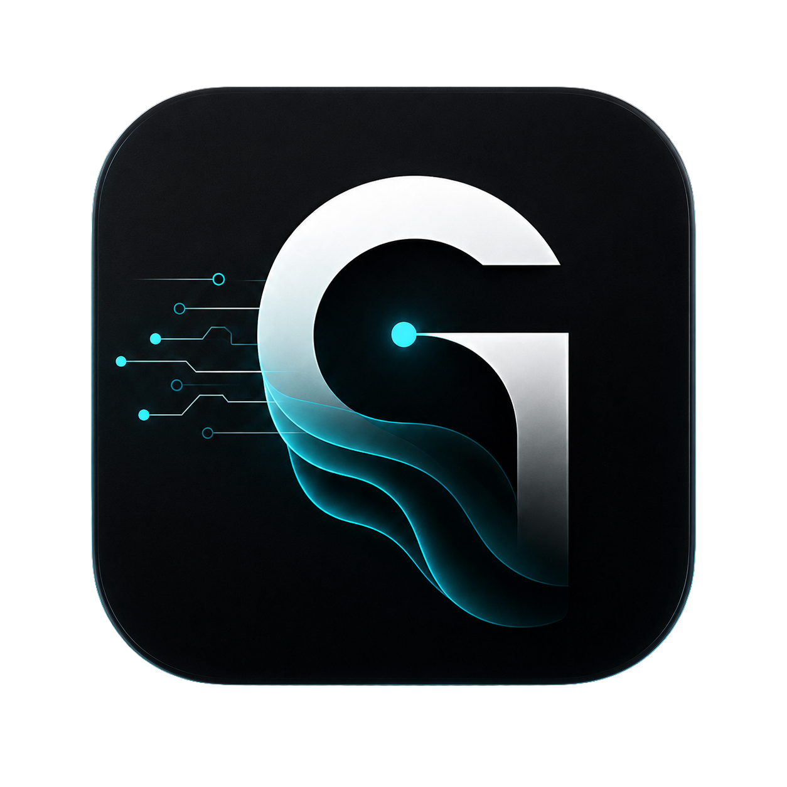

<p align="center">
  
</p>

<h1 align="center">Ghost OS</h1>

<p align="center">
  A long-term personal AI operating system for memory, planning, automation, integrations and connected environments.
</p>


> A long-term personal AI operating system designed to become a central intelligence layer across software, devices, services and connected environments.

Ghost OS is an experimental systems-engineering project inspired by the idea of a persistent AI assistant similar in spirit to JARVIS.

The goal is not to build another chatbot or smart-home dashboard.

Ghost is designed as a modular AI system capable of maintaining memory, planning actions, coordinating automation, connecting external services and eventually interacting with the physical environment.

<p align="center">
  
</p>

## Vision

Ghost OS is intended to become a persistent intelligence layer across my digital and physical environment.

Long-term areas include:

- personal AI interaction
- persistent memory
- task and planning systems
- automation
- software integrations
- cloud services
- home infrastructure
- connected devices
- business systems
- future AI capabilities

## Architecture

The system is designed around independent layers and capabilities.

```text
Ghost Core
    │
    ├── Memory Engine
    ├── Planning Engine
    ├── Automation Engine
    ├── Policy / Capability Layer
    └── Integrations
            │
            ├── Cloud services
            ├── File systems
            ├── APIs
            ├── Business systems
            └── Home / device integrations

           The architecture is intentionally modular so individual providers, models, storage systems and integrations can evolve without requiring the entire system to be rebuilt.

## Current Development

Current work focuses on the foundations required before higher-level autonomous behavior is introduced.

Implemented or under development:

- Modular Ghost core architecture
- Provider-neutral integrations
- Filesystem abstraction
- Google Drive filesystem adapter
- Capability and policy architecture
- Integration layer
- Automated testing
- Architecture documentation

## Engineering Principles

### Architecture First

Major subsystems are designed and documented before implementation.

### Modular by Design

AI providers, storage systems and external services should remain replaceable.

### Privacy and Control

Where practical, Ghost is designed around local control and explicit access boundaries.

### Security

External capabilities should operate through defined permissions and policy controls rather than unrestricted system access.

### Long-Term Extensibility

Ghost OS is intended to evolve over many years rather than being tied to one model, provider or generation of AI technology.

## Project Status

Ghost OS is an active long-term research and engineering project.

The current repository represents foundational architecture and infrastructure rather than the final user-facing system.
